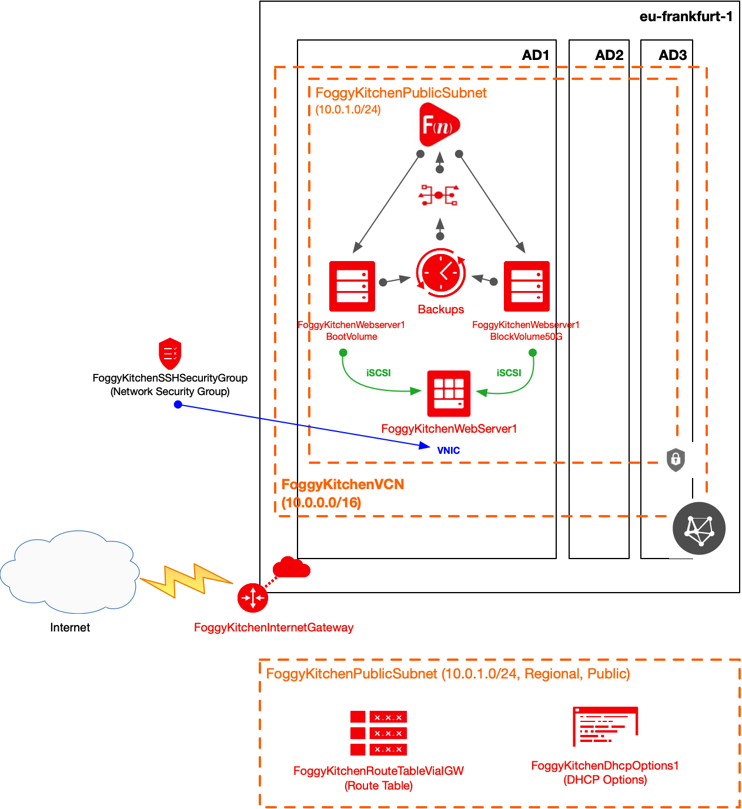
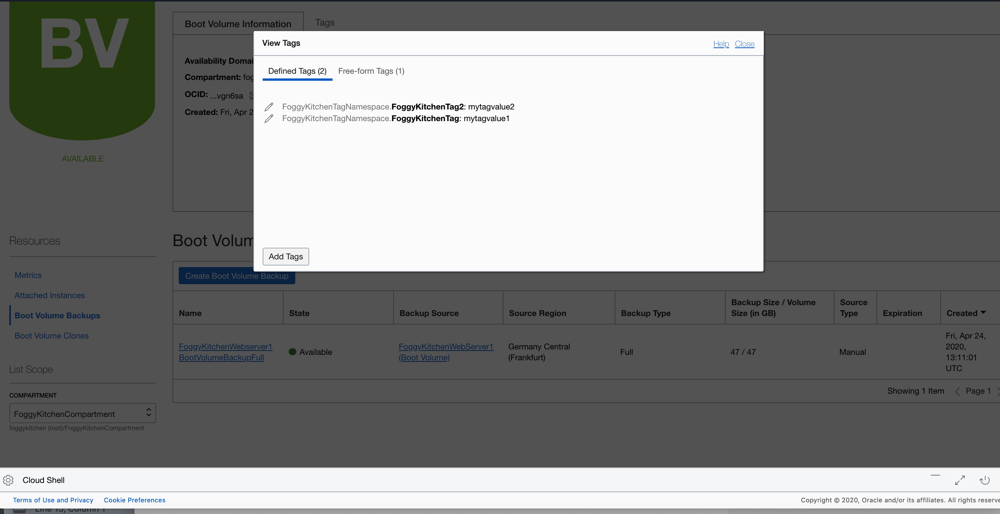
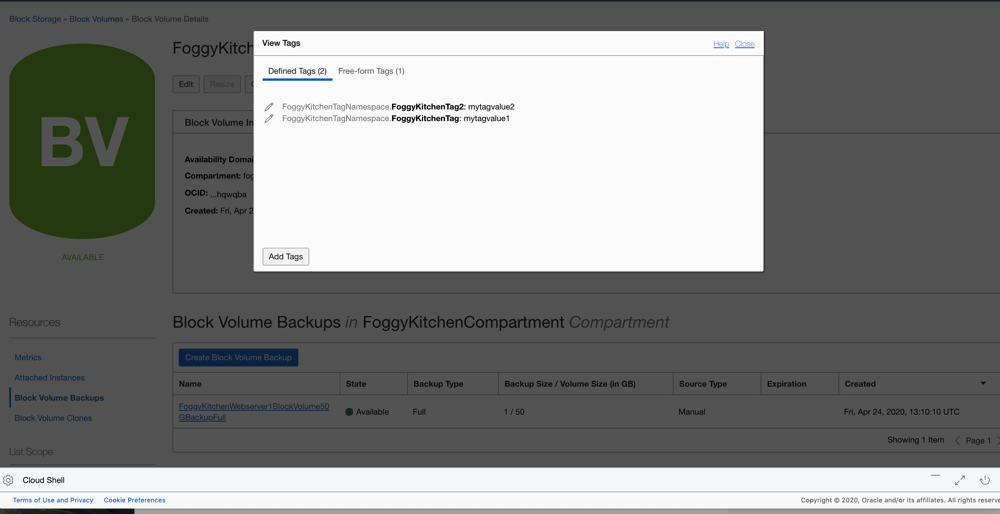

# Terraform OCI Event Services and Functions

## Project description

In this repository I have documented my hands-on experience with Terrafrom for the purpose of OCI Event Services and Functions deployment. This set of HCL based Terraform files can customized according to any requirements.  

## Topology Diagram 

With the usage of this example HCL code you can build topology documented by diagram below. This topology is extremly simplified for education purposes and rather cannot be used for production implementations. 



## How to use code 

### STEP 1.

Within OCI Cloud Shell clone the repo from GitHub by executing the command as follows and then go to terraform-oci-event-functions directory:

```
martin_lin@cloudshell:terraform-oci-events-functions (eu-frankfurt-1)$ git clone https://github.com/mlinxfeld/terraform-oci-events-functions.git
Cloning into 'terraform-oci-events-functions'...
remote: Enumerating objects: 62, done.
remote: Counting objects: 100% (62/62), done.
remote: Compressing objects: 100% (46/46), done.
remote: Total 62 (delta 22), reused 55 (delta 15), pack-reused 0
Unpacking objects: 100% (62/62), done.

martin_lin@cloudshell:terraform-oci-events-functions (eu-frankfurt-1)$ cd terraform-oci-events-functions/

martin_lin@cloudshell:terraform-oci-events-functions (eu-frankfurt-1)$ ls -latr
total 752
-rw-r--r--.  1 martin_lin oci   1232 Apr 24 10:43 event_services.tf
-rw-r--r--.  1 martin_lin oci    414 Apr 24 10:43 dhcp_options.tf
-rw-r--r--.  1 martin_lin oci    185 Apr 24 10:43 compartment.tf
-rw-r--r--.  1 martin_lin oci    250 Apr 24 10:43 internet_gateway.tf
-rw-r--r--.  1 martin_lin oci   1066 Apr 24 10:43 functions.tf
drwxr-xr-x.  4 martin_lin oci     78 Apr 24 10:43 functions
-rw-r--r--.  1 martin_lin oci    614 Apr 24 10:43 tags.tf
-rw-r--r--.  1 martin_lin oci    432 Apr 24 10:43 subnet1.tf
-rw-r--r--.  1 martin_lin oci    259 Apr 24 10:43 security_group.tf
-rw-r--r--.  1 martin_lin oci    775 Apr 24 10:43 security_group_rules.tf
-rw-r--r--.  1 martin_lin oci    431 Apr 24 10:43 route.tf
-rw-r--r--.  1 martin_lin oci   1606 Apr 24 10:43 policies.tf
-rw-r--r--.  1 martin_lin oci   1082 Apr 24 10:43 webserver1_volumes.tf
-rw-r--r--.  1 martin_lin oci   1756 Apr 24 10:43 webserver1.tf
-rw-r--r--.  1 martin_lin oci    502 Apr 24 10:43 vcn.tf
-rw-r--r--.  1 martin_lin oci 620155 Apr 24 10:43 terraform-oci-events-functions.jpg
drwxr-xr-x.  3 martin_lin oci     21 Apr 24 10:43 .terraform
-rw-r--r--.  1 martin_lin oci   1655 Apr 24 11:39 fn_setup.tf
drwxr-xr-x.  8 martin_lin oci   4096 Apr 24 12:18 .git
-rw-r--r--.  1 martin_lin oci    819 Apr 24 12:19 variables.tf
-rw-r--r--.  1 martin_lin oci    232 Apr 24 12:19 provider.tf
-rw-r--r--.  1 martin_lin oci   1049 Apr 24 12:35 webserver1_volume_backups.tf
drwxr-xr-x. 10 martin_lin oci   4096 Apr 24 12:35 ..
-rw-r--r--.  1 martin_lin oci  54893 Apr 24 12:44 terraform.tfstate.backup
-rw-r--r--.  1 martin_lin oci    158 Apr 24 12:50 terraform.tfstate
drwxr-xr-x.  5 martin_lin oci   4096 Apr 24 12:50 .

```

### STEP 3. 
Next create environment file with TF_VARs:

```
martin_lin@cloudshell:terraform-oci-events-functions (eu-frankfurt-1)$  vi setup_oci_tf_vars.sh
export TF_VAR_tenancy_ocid="ocid1.tenancy.oc1..aaaaaaaasbktyck(...)j2s3gdbz7d2heqzzxn7pe64ksbia"
export TF_VAR_compartment_ocid="ocid1.tenancy.oc1..aaaaaaaasbk(...)gdbz7d2heqzzxn7pe64ksbia"
export TF_VAR_region="eu-frankfurt-1"
export TF_VAR_private_key_oci="/home/martin_lin/id_rsa"
export TF_VAR_public_key_oci="/home/martin_lin/id_rsa.pub"
export TF_VAR_ocir_namespace="fr5tvfiq2xhq"
export TF_VAR_ocir_repo_name="functions"
export TF_VAR_ocir_docker_repository="fra.ocir.io"
export TF_VAR_ocir_user_name="martin.linxfeld@foggykitchen.com"
export TF_VAR_ocir_user_password="<auth_oci_token>"

martin_lin@cloudshell:terraform-oci-events-functions (eu-frankfurt-1)$  source setup_oci_tf_vars.sh
```

### STEP 4.
Run *terraform init* with upgrade option just to download the lastest neccesary providers:

```
martin_lin@cloudshell:terraform-oci-events-functions (eu-frankfurt-1)$ terraform init

Initializing the backend...

Initializing provider plugins...
- Checking for available provider plugins...
- Downloading plugin for provider "null" (hashicorp/null) 2.1.2...
- Downloading plugin for provider "oci" (hashicorp/oci) 3.72.0...

The following providers do not have any version constraints in configuration,
so the latest version was installed.

To prevent automatic upgrades to new major versions that may contain breaking
changes, it is recommended to add version = "..." constraints to the
corresponding provider blocks in configuration, with the constraint strings
suggested below.

* provider.null: version = "~> 2.1"

Terraform has been successfully initialized!

You may now begin working with Terraform. Try running "terraform plan" to see
any changes that are required for your infrastructure. All Terraform commands
should now work.

If you ever set or change modules or backend configuration for Terraform,
rerun this command to reinitialize your working directory. If you forget, other
commands will detect it and remind you to do so if necessary.
```

### STEP 5.
Run *terraform apply* to provision the content of this code (type **yes** to confirm the the apply phase):

```
martin_lin@cloudshell:terraform-oci-events-functions (eu-frankfurt-1)$ terraform apply
data.oci_core_images.OSImageLocal: Refreshing state...
data.oci_identity_availability_domains.ADs: Refreshing state...
oci_identity_compartment.FoggyKitchenCompartment: Refreshing state... 

(...)

Plan: 2 to add, 0 to change, 0 to destroy.

Do you want to perform these actions?
  Terraform will perform the actions described above.
  Only 'yes' will be accepted to approve.

  Enter a value: yes

(...)

oci_core_boot_volume_backup.FoggyKitchenWebserver1BootVolumeBackupFull: Still creating... [1m20s elapsed]
oci_core_boot_volume_backup.FoggyKitchenWebserver1BootVolumeBackupFull: Still creating... [1m30s elapsed]
oci_core_boot_volume_backup.FoggyKitchenWebserver1BootVolumeBackupFull: Still creating... [1m40s elapsed]
oci_core_boot_volume_backup.FoggyKitchenWebserver1BootVolumeBackupFull: Still creating... [1m50s elapsed]
oci_core_boot_volume_backup.FoggyKitchenWebserver1BootVolumeBackupFull: Still creating... [2m0s elapsed]
oci_core_boot_volume_backup.FoggyKitchenWebserver1BootVolumeBackupFull: Still creating... [2m10s elapsed]
oci_core_boot_volume_backup.FoggyKitchenWebserver1BootVolumeBackupFull: Still creating... [2m20s elapsed]
oci_core_boot_volume_backup.FoggyKitchenWebserver1BootVolumeBackupFull: Still creating... [2m30s elapsed]
oci_core_boot_volume_backup.FoggyKitchenWebserver1BootVolumeBackupFull: Creation complete after 2m34s [id=ocid1.bootvolumebackup.oc1.eu-frankfurt-1.abtheljrhcgyvwdnzki3a6xntud4fmykepe7nyr7x6b6ui3c62pgprzzrudq]

Apply complete! Resources: 27 added, 0 changed, 0 destroyed.

Outputs:

FoggyKitchenWebserver1_PublicIP = [
  "130.61.218.62",
]

(...)

```

### STEP 6.
Confirm that manual backups has tagging information inherited from the volumes:

**Backup of Boot Volume**



**Backup of Block Volume**



### STEP 7.
After testing the environment you can remove the whole OCI infra. You should just run *terraform destroy* (type **yes** for confirmation of the destroy phase):

```
martin_lin@cloudshell:terraform-oci-events-functions (eu-frankfurt-1)$ terraform destroy
data.oci_core_images.OSImageLocal: Refreshing state...
data.oci_identity_availability_domains.ADs: Refreshing state...
oci_identity_policy.FoggyKitchenFunctionsServiceReposAccessPolicy: Refreshing state... [id=ocid1.policy.oc1..aaaaaaaa7yla6b3i3jajdqotdf277dn74p442syyfz4fcp3ai5oaymjjayfa]

(...)

Plan: 0 to add, 0 to change, 27 to destroy.

Do you really want to destroy all resources?
  Terraform will destroy all your managed infrastructure, as shown above.
  There is no undo. Only 'yes' will be accepted to confirm.

  Enter a value: yes

(...)

oci_identity_tag_namespace.FoggyKitchenTagNamespace: Destruction complete after 0s
oci_identity_compartment.FoggyKitchenCompartment: Destroying... [id=ocid1.compartment.oc1..aaaaaaaagillnk7ttj6wpdhmewpibpxc5gbmrfxdtmaa3gfgjzbudesm3tsq]
oci_identity_compartment.FoggyKitchenCompartment: Destruction complete after 0s

Destroy complete! Resources: 27 destroyed.
```
